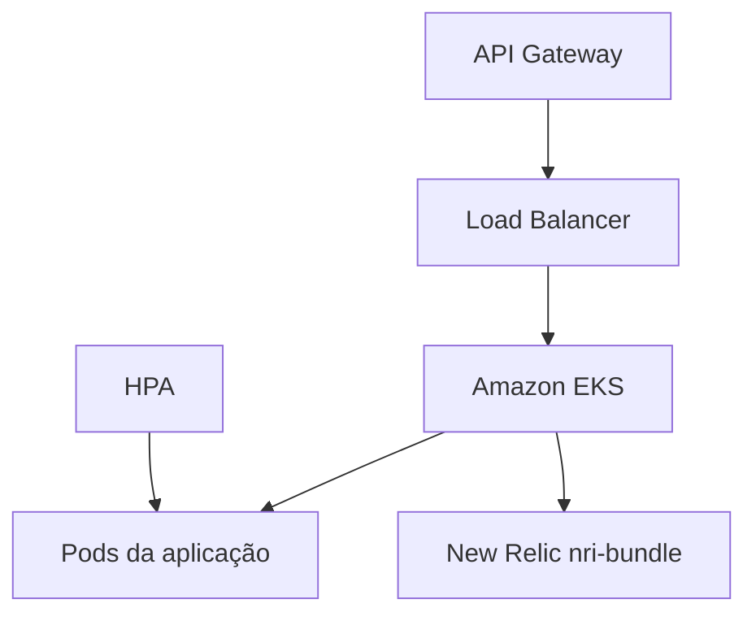

# Oficina Kubernetes Infrastructure — Fase 3

Infraestrutura como código do ambiente Kubernetes da oficina mecânica na AWS Academy.

## Responsabilidades

- VPC, subnets, rotas, Internet Gateway e NAT Gateway;
- Amazon EKS e node groups;
- Load Balancer e conectividade privada;
- namespaces, escalabilidade e HPA;
- integração Kubernetes do New Relic;
- outputs de rede consumidos pelos outros repositórios.

Não contém aplicação Spring Boot, Lambda, schema ou provisionamento do RDS.

## Arquitetura



## Tecnologias

- Terraform e HCP Terraform;
- AWS VPC, EKS e Load Balancer;
- Kubernetes e Helm;
- New Relic `nri-bundle`;
- GitHub Actions.

## Validação

```bash
terraform fmt -check -recursive
terraform init -backend=false -input=false
terraform validate
```

O CI também executa TFLint, Trivy e Gitleaks. O plan real é manual e utiliza HCP Terraform; nenhum workflow executa apply automático.

## Documentação

- [Arquitetura](docs/architecture.md)
- [AWS Academy](docs/aws-academy.md)
- [New Relic no Kubernetes](docs/new-relic.md)
- [HCP Terraform e execução](docs/hcp-terraform.md)
- [Add-ons e escalabilidade](docs/kubernetes-addons.md)
- [Validação](docs/validation.md)
- [Repositórios da solução](docs/repositories.md)

## Contribuição

- mudanças somente por Pull Request;
- `main` representa produção;
- `homolog` representa homologação;
- plan obrigatório antes do apply;
- nenhum segredo ou arquivo de state versionado.
