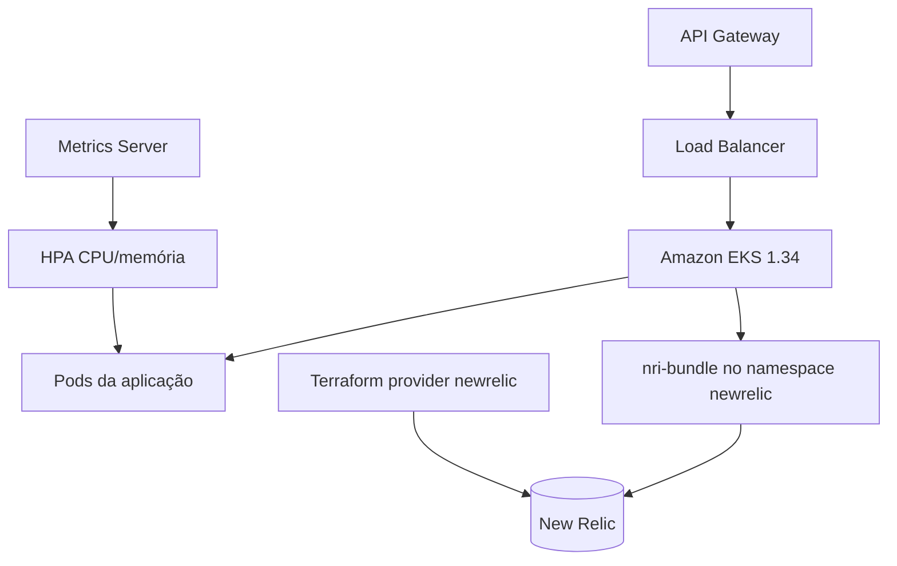

# Oficina Kubernetes Infrastructure — Fase 3

Infraestrutura como código do ambiente Kubernetes e da observabilidade da
oficina mecânica na AWS Academy.

## Responsabilidades

- VPC, subnets, rotas, Internet Gateway e NAT Gateway;
- Amazon EKS 1.34 e node groups;
- Load Balancer e conectividade privada;
- Metrics Server e suporte ao HPA da aplicação;
- integração Kubernetes do New Relic (`nri-bundle`);
- dashboards, alertas e monitor sintético do New Relic como código;
- outputs de rede consumidos pelos outros repositórios.

Não contém aplicação Spring Boot, Lambda, schema ou provisionamento do RDS.

## Arquitetura



Diagrama detalhado da camada de infraestrutura e observabilidade em
`docs/diagrams/infrastructure-observability.mmd`.

## Estrutura

| Caminho | Conteúdo |
|---|---|
| `network.tf`, `eks.tf`, `variables.tf`, `outputs.tf` | rede, EKS 1.34 e add-ons gerenciados |
| `environments/*.tfvars.example` | exemplos de variáveis por ambiente |
| `kubernetes/addons/` | values dos charts e versões fixadas |
| `scripts/` | validação de sessão AWS, deploy, verificação e lint offline |
| `observability/newrelic/` | dashboards, alertas, sintético e notificações |
| `.github/workflows/` | CI, plan e deploy automático por merge com gates |

## Tecnologias

- Terraform `>= 1.6, < 2.0` e HCP Terraform (workspaces separados por ambiente);
- AWS VPC, EKS 1.34 e Load Balancer;
- Kubernetes, Helm, Metrics Server e HPA;
- New Relic `nri-bundle` `8.0.10` e provider Terraform `newrelic` `~> 3.95.0`;
- GitHub Actions com GitHub Environments.

## Segredos

Nenhuma credencial é versionada. Por GitHub Environment (`homolog` e
`production`):

- secrets: `TF_API_TOKEN`, `AWS_ACCESS_KEY_ID`, `AWS_SECRET_ACCESS_KEY`,
  `AWS_SESSION_TOKEN`, `NEW_RELIC_LICENSE_KEY`, `NEW_RELIC_API_KEY`;
- variables: `TF_CLOUD_ORGANIZATION`, `TF_WORKSPACE_HOMOLOG`,
  `TF_WORKSPACE_PRODUCTION`, `TF_WORKSPACE_OBSERVABILITY_HOMOLOG`,
  `TF_WORKSPACE_OBSERVABILITY_PRODUCTION`, `NEW_RELIC_ACCOUNT_ID` e, quando
  necessário, `AWS_REGION`, `CLUSTER_NAME`, `APP_NAMESPACE`,
  `HEALTH_CHECK_URL`, `SYNTHETIC_MONITOR_ENABLED`.

A license key do New Relic só existe como secret do GitHub Environment e como
Secret Kubernetes `newrelic-license` (chave `licenseKey`, namespace `newrelic`),
criado no momento do deploy e referenciado por `global.customSecretName`.

## Validação gratuita

```bash
terraform fmt -check -recursive
terraform init -backend=false -input=false -lockfile=readonly
terraform validate

cd observability/newrelic && terraform init -backend=false -lockfile=readonly && terraform validate && cd -

./scripts/lint-cluster-addons.sh
yamllint -c .yamllint.yml kubernetes .github/workflows
shellcheck scripts/*.sh
```

O CI executa essas validações, TFLint, Trivy e Gitleaks em quatro jobs sequenciais: validação do repositório → Terraform da infraestrutura → Terraform da observabilidade → add-ons Kubernetes. Pull Requests nunca executam apply.

## Deploy

Pull Requests para `homolog` ou `main` executam plans de infraestrutura e observabilidade sem apply. Merges em `homolog` exibem jobs sequenciais de validação → infraestrutura → add-ons → observabilidade → resumo, sem aprovação manual. Merges em `main` preservam um único job e uma única aprovação no GitHub Environment `production`. A execução manual permite repetir o deploy completo na branch correspondente durante bootstrap ou recuperação. Destroy permanece manual fora da esteira. Detalhes em [Deploy, rollback e troubleshooting](docs/deployment.md).

## Documentação

- [Arquitetura](docs/architecture.md)
- [AWS Academy](docs/aws-academy.md)
- [New Relic no Kubernetes](docs/new-relic.md)
- [Observabilidade como código](docs/observability-as-code.md)
- [Add-ons e escalabilidade](docs/kubernetes-addons.md)
- [Deploy, rollback e troubleshooting](docs/deployment.md)
- [HCP Terraform e execução](docs/hcp-terraform.md)
- [Validação](docs/validation.md)
- [Repositórios da solução](docs/repositories.md)

## Contribuição

- mudanças somente por Pull Request;
- `main` representa produção;
- `homolog` representa homologação;
- plan obrigatório antes do apply;
- nenhum segredo ou arquivo de state versionado.
